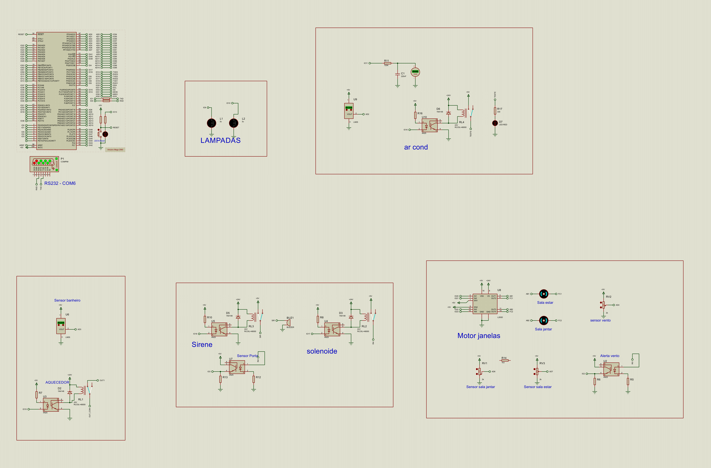
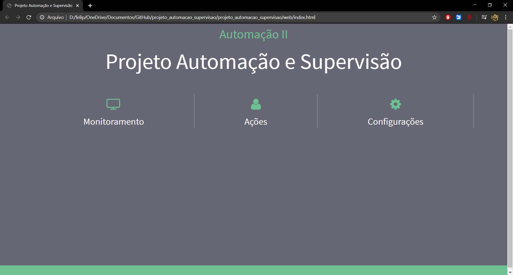
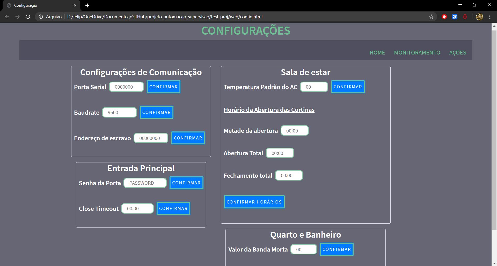
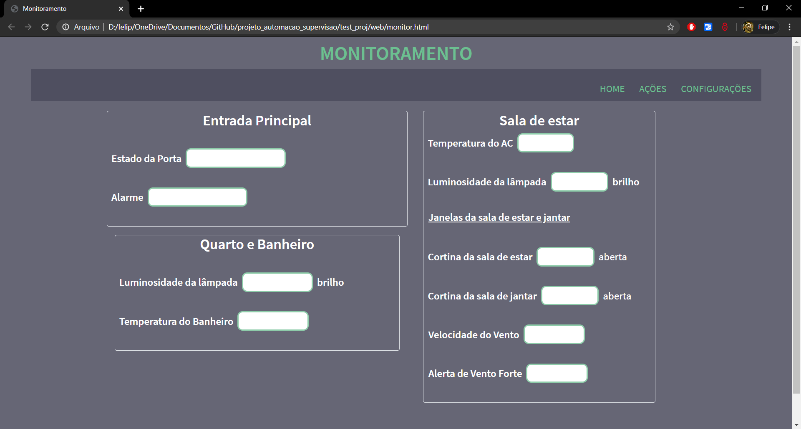
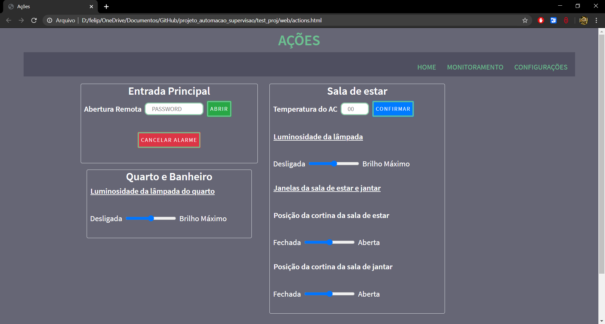
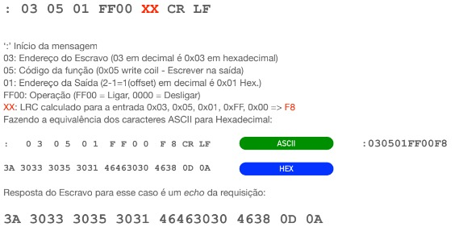

# Projeto Automação e Supervisão

+ ## Descrição geral do sistema:

  + O objetivo é projetar um sistema de controle para automatizar um pequeno apartamento. O
    sistema deverá monitorar algumas variáveis (temperatura, velocidade do vento..) e atuar
    sobre alguns dispositivos (motores, relés, aquecedores...). O estado atual das variáveis é
    visualizado através de uma interface WEB, sendo possível atuar sobre elas. 

    + #### Planta baixa do apartamento:

      

        
      

    + #### Diagrama esquemático do sistema:
    
    

     
     

     
+ ## Descrição do controle

  + ### Entrada Principal
  
    + O estado atual da porta é monitorado por um sensor digital alimentado em 24V.
    + Uma solenoide, também de 24V, destrava a porta remotamente. Para que isso seja possível, uma senha, previamente definida nos parâmetros de configuração da interface WEB, é solicitada ao receber o comando remoto para destravamento. 
    + Após destravar, a porta deve ser fechada em um tempo máximo, também definido nos parâmetros de configuração da interface WEB, caso isso não aconteça, uma alarme sonoro é ativado de forma intermitente (2 min. ON, 5 min. OFF), até o fechamento da porta ou desativação manual através de comando remoto, também protegido pela senha.
  
  + ### Sala de estar
  
    + Conta com sensor de temperatura do tipo digital, este sensor é responsável por ligar
      o ar condicionado a fim de manter a temperatura em um valor previamente definido nos parâmetros de configuração da interface WEB.
    + O controle do ar condicionado também pode ser ativado remotamente de forma manual, ignorando o sensor de temperatura presente na sala, para isso, uma saída analógica indica a temperatura desejada, sendo 1,7V igual a 17 graus celsius, 2,5V 25 graus celsius.
    + A luminosidade da sala de estar é controlada remotamente, para isso, uma saída analógica é utilizada, sendo 0V lâmpada desligada e 5V lâmpada em seu brilho máximo.
  
  + ### Janelas da sala de estar e jantar
  
    + As cortinas das janelas são controladas por motores DC de 24V. A posição atual de cada cortina é monitorada por sensores analógicos, tais sensores indicam 1V quando a cortina está totalmente fechada e 4V quando está totalmente aberta.
    + As cortinas são abertas automaticamente conforme horários programados na página de parâmetros de configuração da interface WEB. Três horários poderão ser programados:
      + Horário (Time 1) para abertura na metade do seu curso (Ex. 08:00 horas).
      + Horário (Time 2) para abertura total (Ex. 12:00 horas).
      + Horário (Time 3) para fechamento total(Ex. 18:00 horas)
    + A posição de cada cortina também pode ser definida pelo usuário, para isso é possível utilizar um controle do tipo slide, na página de ações, para mover os motores até a posição desejada.
    + **Fechamento de emergência:** 
      + A velocidade do vento é monitorada continuamente por um sensor analógico externo, tal sensor tem a seguinte característica, 0,5V é equivalente a 5 km/h 4,5V é 150 km/h. Sempre que a velocidade do vento for superior a 50 km/h as cortinas são fechadas e um aviso deve é  para a página WEB.
    
  + ### Quarto e banheiro
  
    + Possui luminosidade controlada remotamente, para isso, uma saída analógica é utilizada, sendo 0V lâmpada desligada e 5V lâmpada em seu brilho máximo.
    + Possui sensor de temperatura analógico do tipo LM35, quando a temperatura é inferior a 17 graus celsius, o aquecedor liga. O controle de temperatura utilizado é do tipo banda morta, o valor da banda morta é configurado na página de parâmetros de configuração da interface WEB.
     
     
+ ## Interface WEB

  + O bloco de interface WEB contém 4 páginas. Sendo:
    + **Página Inicial:** Primeira página do sistema a ser mostrada
    
      

        
      

    
    
    + **Página de Configurações:** Inclui os itens descritos no projeto e também
      as configurações de comunicação entre o servidor e controlador (porta serial,
      baudrate, endereço de cliente).
      
      

        
      

    
    
    + **Página de Monitoração:** Mostra o estado atual dos sensores e
      atuadores presentes no projeto, é atualizada a cada 1 segundo.
      
      

        
      

    
    
    + **Página de Ações:** Apresenta os detalhes específicos de cada cômodo,
      além das opções de controle manual sobre os atuadores.
      
      

        
      

      
+ ## Protocolo de Comunicação
  + O projeto utiliza o protocolo de comunicação mestre-escravo Modbus em modo ASCII via RS-232, o qual permite apenas dois dispositivos na rede, comumente conhecido como conexão ponto-a-ponto, sendo o Modbus o mestre, e o Arduino o escravo.
      

        
      

      
  + Alguns exemplos de mensagens utilizadas no projeto:
      + Comunicação para fechar a porta - :0302020000
      + Comunicação para definir temperatura do banheiro - :0307040015
      + Resporta do firmware com velocidade do vento - :0306050030

   
   
    
+ ## Periféricos

  + **Sensores e Atuadores:** ...
  + **MCU:** O MCU utilizado tanto na simulação quanto na montagem prática foi o ATMega328p (Arduino).

+ ## Software
  
  + **IDE:** A IDE utilizada foi a [PlatformIO](https://platformio.org/) com o [Visual Studio Code](https://code.visualstudio.com/). Para o servidor foi utilizada a biblioteca         [Socket.IO](https://socket.io/).
  + **Arquivo .hex:** Ao compilar a aplicação, os arquivos .hex e .elf ficam localizados na pasta **\.pio\build\uno**.
    

+ ## Autores
  * **Felipe Tavares** - [felipe-tavares](https://github.com/felipe-tavares)
  * **Rafael Panizzon** - [rfpanizzon](https://github.com/rfpanizzon)
  * **Gustavo Sbardelotto** - [gus004](https://github.com/gus004)
